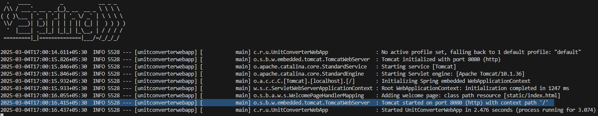

# [COMPLETE] Weather API Service

This service returns weather data. Instead of relying on own weather data, it fetches and returns weather data from a 3rd party API ([Visual Crossing’s API](https://www.visualcrossing.com/weather-api/)). We use Redis instead of Springboot Simple Provider, as Redis is popular technology for caching.


### Technologies Used:
- **Frontend:** Java, CSS and JS
- **Backend:** Java, Springboot, Rest API, Jackson, 3rd Party API integration, Redis
- **Source Code Management:** Git, GitHub, Maven

### Installation
1. Clone the repo
```bash
    git clone git@github.com:avinashee0012/weather-api-service.git
    cd weather-api-service
```
2. Setup Redis
    - Visit [Redis.io Installation Page](https://redis.io/docs/latest/operate/oss_and_stack/install/install-redis/)
    - Install Redis based on your OS
    - Check if Redis Server is running

3. Setup [Visual Crossing’s API](https://www.visualcrossing.com/weather-api/) account

3. Run Jar
```bash
    # Default REDIS_PORT is 6379
    java -jar weather-api-service-0.0.1.jar --spring.data.redis.port=<REDIS_PORT>
```
4. Visit http://localhost:8080/api/

NOTE: 
- If port 8080 is busy, another port will be used and can be found from terminal logs (see example below):


### Usage Example
- Endpoint 1: <code>/api/weather/<city_name>?key=<your_visualcrossing_key></code>
- Endpoint 2: <code>/api/weather/<city_name>/<start_date>?key=<your_visualcrossing_key></code>
- Endpoint 3: <code>/api/weather/<city_name>/<start_date>/<end_date>?key=<your_visualcrossing_key></code>

_____
Future Improvements:
1. Once data is fetched with correct key, Redis doesn't validate if future calls are made with correct key or not.

####
Project Idea: [roadmap.sh](https://roadmap.sh/projects/weather-api-wrapper-service)